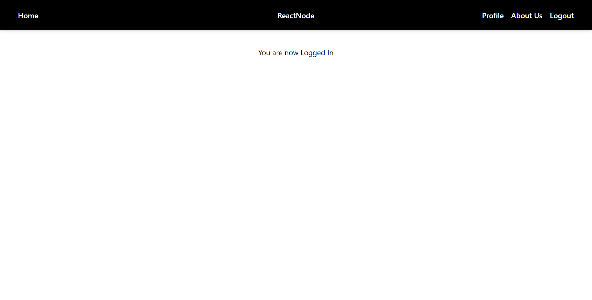

<h1>ReactNode</h1> is just simple User Authentication 

These App is now deployed on Heroku so Go check it out

Live App Link --> https://reactnodeauth.herokuapp.com/

<h1>Technical Details -- </h1>

--> CURD operations using RESTfull Api created with Express.js and Node.js

--> Beautiful User Interface Using Tailwind CSS.

--> Secure login and Hashed Password using JWT tokens & Bcrypt.js.

--> Data Stored in MonogoDB Atlas.

<h1>ScreenShots</h1>

<h3>Landing Page</h3>

<h3>Signup Page</h3>

<h3>Login Page</h3>

<h3>Dashboard</h3>

<h3>Form Validations</h3>

<h3>Error Handling</h3>

